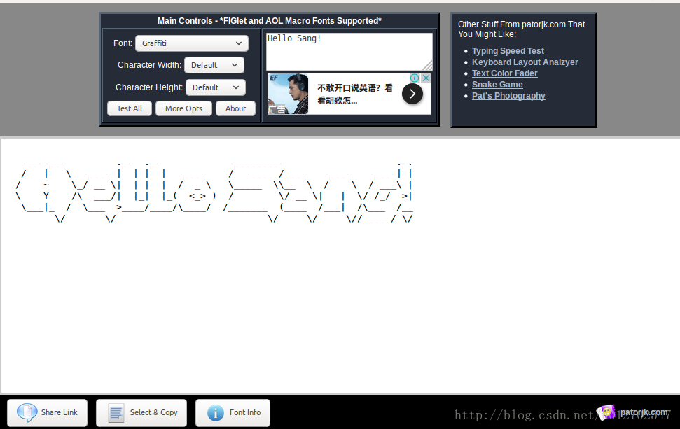
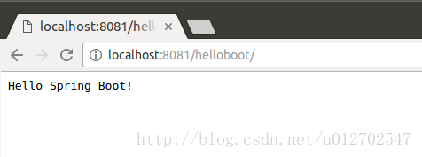
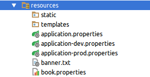
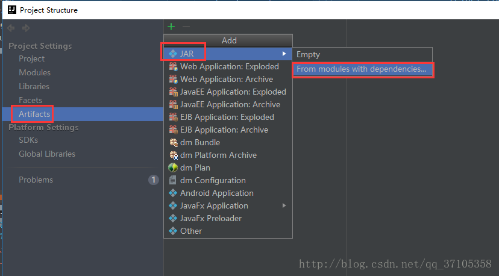
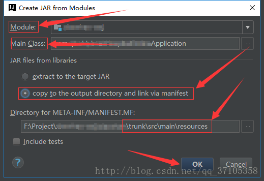
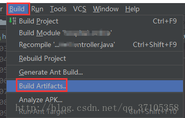
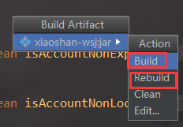

# 目录


[TOC]

# Spring Boot项目基本结构

```
com
 +- example
     +- myproject
         +- Application.java
         |
         +- domain
         |   +- Customer.java
         |   +- CustomerRepository.java
         |
         +- service
         |   +- CustomerService.java
         |
         +- web
             +- CustomerController.java   
```

`Application.java`是应用的入库，一般放在根目录。

所有的资源文件都统一放在resources目录下，结构如下:

```
static
 +- css
 |   +- style.css
 |   +- common.css
 +- js
 |   +- index.js
 +- img
     +- img.png
     
templates
 +- index.html
 |   
 +- pages
 |   +- page.html
```

**我们所有的配置文件都默认放在在resources目录下**

像CSS样式表、JavaScript文件、图片等静态资源都放在`static`目录下，HTML页面放在`template`目录下


# Entity实体注意点

entity实体的@Column注解问题：建议下划线分割。

例如数据表中有productName字段，实体中应当这样写    

**@Column(name = "productname")**

​    **private String productName;**

或者

**@Column(name = "product_name")**

​    **private String productName;**


# Spring Boot JPA 命名规则

以下表格摘录自[官方文档](https://docs.spring.io/spring-data/jpa/docs/1.4.3.RELEASE/reference/html/jpa.repositories.html)

| Keyword           | Sample                         | JPQL snippet                                                 |
| ----------------- | ------------------------------ | ------------------------------------------------------------ |
| And               | findByLastnameAndFirstname     | … where x.lastname = ?1 and x.firstname = ?2                 |
| Or                | findByLastnameOrFirstname      | … where x.lastname = ?1 or x.firstname = ?2                  |
| Between           | findByStartDateBetween         | … where x.startDate between 1? and ?2                        |
| LessThan          | findByAgeLessThan              | … where x.age < ?1                                           |
| GreaterThan       | findByAgeGreaterThan           | … where x.age > ?1                                           |
| After             | findByStartDateAfter           | … where x.startDate > ?1                                     |
| Before            | findByStartDateBefore          | … where x.startDate < ?1                                     |
| IsNull            | findByAgeIsNull                | … where x.age is null                                        |
| IsNotNull,NotNull | findByAge(Is)NotNull           | … where x.age not null                                       |
| Like              | findByFirstnameLike            | … where x.firstname like ?1                                  |
| NotLike           | findByFirstnameNotLike         | … where x.firstname not like ?1                              |
| StartingWith      | findByFirstnameStartingWith    | … where x.firstname like ?1 (parameter bound with appended %) |
| EndingWith        | findByFirstnameEndingWith      | … where x.firstname like ?1 (parameter bound with prepended %) |
| Containing        | findByFirstnameContaining      | … where x.firstname like ?1 (parameter bound wrapped in %)   |
| OrderBy           | findByAgeOrderByLastnameDesc   | … where x.age = ?1 order by x.lastname desc                  |
| Not               | findByLastnameNot              | … where x.lastname <> ?1                                     |
| In                | findByAgeIn(Collection ages)   | … where x.age in ?1                                          |
| NotIn             | findByAgeNotIn(Collection age) | … where x.age not in ?1                                      |
| True              | findByActiveTrue()             | … where x.active = true                                      |
| False             | findByActiveFalse()            | … where x.active = false                                     |

# 对于Dao层接口的扩展

一般我们的Dao层接口继承`JpaRepository`接口，该接口提供了基本的CURD操作，但是我们如果想更加细化的进行数据库操作，如何处理？

> 新建一个接口，然后继承该接口，编写具体实现即可

例如：

```java
public interface DemoDaoI extends JpaRepository<TDemo, String> {
    List<TDemo> findByName(String name);
    List<TDemo> findByrecId(String id);
}
```

`DemoDaoI`接口继承了`JpaRepository`接口，此时我们再定义一个`DemoRepositoryCustom`的接口，进行更加个性化、细致化的操作。

> **注意：接口类名后的`Custom`后缀是固定的，不能自定义！**，即：xxxxCustom

DemoRepositoryCustom接口：

```java
public interface DemoRepositoryCustom {
    void test();
    String queryAge();
}
```

DemoRepositoryCustom接口的实现类，`DemoRepositoryCustomImpl`:

```java
public class DemoRepositoryCustomImpl implements DemoRepositoryCustom {
    @Autowired
    @PersistenceContext
    private EntityManager entityManager;


    @Override
    public void test() {
        List<Object[]> cities = entityManager.createNativeQuery("select name from T_Demo").getResultList();
        for (Object objs : cities) {
            System.out.print("Val:" + objs);
        }
    }

    @Override
    public int queryAge() {
        return 0;
    }
}
```

调用：

```java
package com.springboot2.controller;

import com.springboot2.dao.DemoDaoI;
import com.springboot2.entity.TDemo;
import org.springframework.beans.factory.annotation.Autowired;

import java.util.List;


@RestController
public class DataController {
    @Autowired
    DemoDaoI demoDaoI;

    @RequestMapping("/demo")
    public List<TDemo> getDemo(String name){
        demoDaoI.test();
        return null;
    }
}

```

相关参考资料：[Spring Boot下如何自定义Repository中的DAO方法](https://blog.csdn.net/blueheart20/article/details/72821384)

# 定制Banner

##修改Banner信息

我们在启动Spring Boot项目的时候，在控制台会默认输出一个启动图案，如下： 
 
当然，这个图案如果你需要的话是可以自己修改的，修改方式很简单：

> 1.在src/main/resources下新建一个banner.txt文档 
> 2.通过[http://patorjk.com/software/taag](http://patorjk.com/software/taag/)网站生成需要的字符，将字符拷贝到步骤1所创建的txt文档中，比如我这里为Hello Sang！生成字符，如下：

 
点击左下角的选择和拷贝按钮，将这个字符拷贝到txt文档中，然后再启动项目，这个时候控制台输出的文本就会自动改变，如下： 


## 关闭Banner

可以修改当然也可以关闭，关闭Banner需要我们稍微修改一下main方法中的代码，如下：

```java
public static void main(String[] args) {
        SpringApplicationBuilder builder = new SpringApplicationBuilder(Test19SpringBoot2Application.class);
        //修改Banner的模式为OFF
        builder.bannerMode(Banner.Mode.OFF).run(args);
}
```

OK，如此修改之后当我们再次启动Project的时候就看不到Banner了。

#Spring Boot配置相关

## Spring Boot的配置文件

Spring Boot使用一个全局的配置文件`application.properties`或者`application.yml`，配置文件放在src/main/resources目录下。properties是我们常见的一种配置文件，Spring Boot不仅支持properties这种类型的配置文件，也支持yaml语言的配置文件，我这里以properties类型的配置文件为例来看几个案例。

> 1.修改Tomcat默认端口和默认访问路径

Tomcat默认端口是8080，我将之改为8081，默认访问路径是[http://localhost:8080](http://localhost:8080/)，我将之改为<http://localhost:8081/helloboot>,我们来看看这两个需求要怎么样通过简单的配置来实现。 
很简单，在application.properties文件中添加如下代码：

```
server.context-path=/helloboot
server.port=808112
```

然后再启动Project，在浏览器中就得这样来访问了： 



## SpringMVC基础配置(注解配置)

> 参考地址：[点击此处](https://blog.csdn.net/u012702547/article/details/53674867)

## SpringMVC常用配置

> 参考地址：[点击此处](https://blog.csdn.net/u012702547/article/details/53695789)

## Spring常用配置

> 参考地址：[点击此处](https://blog.csdn.net/u012702547/article/details/53633872)


##类型安全的配置

我们可以使用基于类型安全的配置方式，就是将properties属性和一个Bean关联在一起，这样使用起来会更加方便。我么来看看这种方式怎么实现。

> 1.在src/main/resources文件夹下创建文件:book.properties

文件内容如下：

```
book.name=红楼梦
book.author=曹雪芹
book.price=28123
```

> 2.创建Book Bean,并注入properties文件中的值

代码如下：

```java 
@Component
@ConfigurationProperties(prefix = "book",locations = "classpath:book.properties")
public class BookBean {
    private String name;
    private String author;
    private String price;

    public String getName() {
        return name;
    }

    public void setName(String name) {
        this.name = name;
    }

    public String getAuthor() {
        return author;
    }

    public void setAuthor(String author) {
        this.author = author;
    }

    public String getPrice() {
        return price;
    }

    public void setPrice(String price) {
        this.price = price;
    }
}
```

prefix是指前缀，location指定要注入文件的位置。

> 3.添加路径映射

在Controller中添加如下代码注入Bean：

```
@Autowired
private BookBean bookBean;
```

添加路径映射：

```java
@RequestMapping("/book")
public String book() {
        return "Hello Spring Boot! The BookName is "+bookBean.getName()+";and Book Author is "+bookBean.getAuthor()+";and Book price is "+bookBean.getPrice();
}
```

运行效果如下： 


## 日志配置

默认情况下Spring Boot使用Logback作为日志框架，也就是我们前面几篇博客中用到的打印日志方式，当然如果有需要我们可以手动配置日志级别以及日志输出位置，相比于我们在Spring容器中写的日志输出代码，这里的配置简直就是小儿科了，只需要在application.properties中添加如下代码：

```
logging.file=/home/sang/workspace/log.log
logging.level.org.springframework.web=debug12
```

上面表示配置日志输出位置，下面配置日志级别。

## Profile配置问题

在[ Spring常用配置 ](http://blog.csdn.net/u012702547/article/details/53633872)这篇文章中，我们已经介绍了Profile的作用，已经如何在Spring框架下使用Profile，但是当时小伙伴们看到了还是稍微有点麻烦，在Spring Boot 中系统提供了更为简洁的方式。全局Profile配置我们使用application-{profile}.properties来定义，然后在application.properties中通过spring.profiles.active来指定使用哪个Profile。OK，那么接下来我们来看一个简单的案例。

> 1.在src/main/resources文件夹下定义不同环境下的Profile配置文件，文件名分别为application-prod.properties和application-dev.properties，这两个前者表示生产环境下的配置，后者表示开发环境下的配置，如下：



application-prod.properties:

```
server.port=80811
```

application-dev.properties:

```
server.port=80801
```

然后在application.properties中进行简单配置，如下：

```
spring.profiles.active=dev1
```

这个表示使用开发环境下的配置。然后运行项目，我们得通过8080端口才可以访问： 
 
如果想换为生产环境，只需要把`spring.profiles.active=dev`改为`spring.profiles.active=prod`即可，当然访问端口这是也变为8081了，如下： 


# 从Session中获取域对象的三种方法

## 1. 利用@SessionAttribute进行获取

这是最简单直接的方法，可以直接在方法的参数中直接进行注入，如下：

```java
//  可以直接从Session中抓取域对象
public Account login(@SessionAttribute Account account) {
    return account;
}
```

上面的方法虽然简单，但是**唯一的缺点是Spring Framework 4.3之前的版本不支持**。

## 2. 利用@SessionAttributes进行获取

与@SessionAttribute不同的是，`@SessionAttributes`不仅多了一个复数“s”，而且从Spring Framework 2.5版本就开始支持，此外**@SessionAttributes还必须注解在类上**，这样类里面的所有方法就可以直接通过`@ModelAttribute`获取域对象，所以总结起来，@SessionAttributes抓取域对象分为两步； 

1. **在类上添加注解@SessionAttributes；** 
2. **在方法的参数中通过@ModelAttribute获取域对象；**

```java
@RestController
@SessionAttributes("account")
public class SecurityContextController {

    @RequestMapping("/account")
    public Account login(@ModelAttribute("account") Account account) {
        return account;
    }
}
```

此外，我们不妨把@SessionAttributes的官方说明重读一遍，以了解它的真正含义，如下：

```
This will typically list the names of model attributes 
which should be transparently stored in the session or some conversational storage, 
serving as form-backing beans. 
Declared at the type level, 
applying to the model attributes that the annotated handler class operates on.
```

大概意思是@SessionAttributes会列出存储在Session或会话中的域对象，就像表单的后台对象一样提供服务，并且必须注解在类型上，并应用于此类的域对象上。

## 3. 直接通过Session获取

这个更简单，直接通过HttpSession获取，但需要更多的类型判断与转换代码，如下：

```java
@RequestMapping("/account")
public Account account(HttpSession session) {
    Object obj = session.getAttribute("account");
    if(obj instanceof Account) {
        Account account = (Account) obj;
        return account;
    }
    return null;
}
```

为了简化Session的调用，充分利用@ModelAttribute方法的初始化特性，我们还可以改进为如下的形式：

```java
public class SecurityContextController {

    ThreadLocal<Account> authContext = new ThreadLocal<>();

    //  此方法会在每次请求前调用（这个类的处理方法）
    @ModelAttribute
    public void initUser(HttpSession session) {
        Object obj = session.getAttribute("account");
        if(obj instanceof Account) {
            Account user = (Account) obj;
            authContext.set(user);
        }
    }

    //  现在可直接使用存储的属性
    @RequestMapping("/getUser")
    public AegisUser get() {
        return authContext.get();
    }

}
```

## 结论

在Spring Boot中，从Session中获取域对象还是比较容易的，唯一可能引起误解或较难使用的只有@SessionAttributes，一定要记住它的二个使用步骤。


# Controller接收POST请求

详情参考：[spring boot get和post请求,以及requestbody为json串时候的处理](https://blog.csdn.net/u010399316/article/details/52913299)

##form-data格式

```java 
@RequestMapping(value = "/login", method = RequestMethod.POST)
public String loginByPost(@RequestParam(value = "name", required = true) String name,
                          @RequestParam(value = "pwd", required = true) String pwd) {
    System.out.println("hello post");
    return "hello post";
}
```

##JSON格式

```java
@RequestMapping(value = "/loginbean", method = RequestMethod.POST)
public String loginByPost2(@RequestBody LoginModel loginModel) {
    System.out.println("hello post,LoginModel,"+loginModel.getName());
    return "hello post,LoginModel";
}
```

通过`@RequestBody`注解，框架会把格式为JSON的串自动转换为对应的Bean对象。


# 将Spring Boot导出为JAR包

1. 打包前确认项目可以正常运行,打开Project Structure 快捷键 Ctrl+Shift+Alt+S,或者点击下图图标


2. 将代码打包,操作如下图所示:



3. 如下图,module选择需要打包的项目名;Main Class 选择项目的主程序类;输出目录确保是空的,如果里面有一个MANIFEST.MF文件,要先删除掉



如果存在就删除,不存在就不必理会


4. 现在将设置都搞定好后,就开始打包,如果初次打包按照以下流程



点击Build Artifacts后会出现下图的弹窗

如果是初次打包点击build,如果不是请点击Rebuild

5. 最后找到输出目录即可

所有的输出文件都在out目录下,运行 java -jar xxxx.jar即可运行项目


# 访问HTML页面

在pom.xml加入

```xml
　　<parent>
        <groupId>org.springframework.boot</groupId>
        <artifactId>spring-boot-starter-parent</artifactId>
        <version>1.5.2.RELEASE</version>
    </parent>
    <dependencies>
        <dependency>
            <groupId>org.springframework.boot</groupId>
            <artifactId>spring-boot-starter-web</artifactId>
        </dependency>
        <dependency>
            <groupId>org.mybatis.spring.boot</groupId>
            <artifactId>mybatis-spring-boot</artifactId>
            <version>1.2.0</version>
        </dependency>
        <dependency>
            <groupId>mysql</groupId>
            <artifactId>mysql-connector-java</artifactId>
        </dependency>
        <dependency>
            <groupId>org.springframework.boot</groupId>
            <artifactId>spring-boot-starter-data-jpa</artifactId>
        </dependency>
        
        <!--解析html包，，，，重要！！！！不然找不到页面-->
        <dependency>
          <groupId>net.sourceforge.nekohtml</groupId>
          <artifactId>nekohtml</artifactId>
          <version>1.9.22</version>
      </dependency>
        <dependency>
            <groupId>org.springframework.boot</groupId>
            <artifactId>spring-boot-starter-thymeleaf</artifactId>
        </dependency>
		<!--解析html包-->
        
        
    </dependencies>
```

在resources\templates\hello.html

```html
<!DOCTYPE html>
<html xmlns="http://www.w3.org/1999/xhtml" xmlns:th="http://www.thymeleaf.org"
      xmlns:sec="http://www.thymeleaf.org/thymeleaf-extras-springsecurity3">
<head>
    <title>Hello World!</title>
</head>
<body>
<h1 th:inline="text">Hello.v.2</h1>
<p th:text="${hello}"></p>
</body>
</html>
```


在Controller中加入

```java
@Controller  //注意这里必须为@Controller,不能是@RestController ，因为@RestController 返回的是字符串结果
//@RestController
public class HelloController {

    /**
     * 本地访问内容地址 ：http://localhost:8080/hello
     *
     * @param map
     * @return
     */
    @RequestMapping("/hello")
    public String helloHtml(HashMap<String, Object> map) {
        map.put("hello", "欢迎进入HTML页面");
        return "/index.html";
    }
}
```

启动，然后输入localhost:8080/hello

会跳转到页面


**注意：**

- 必须加入thymeleaf包，不然找不到页面。
- Controller的注解必须是`@Controller`而不是@RestController

##有关thymeleaf的配置

配置application.properties 

​       注意  1.结尾一定要有------ #thymeleaf end ---------  否则掉坑

​                2.#模板编码 spring.thymeleaf.mode=LEGACYHTML5

​                要想使用LEGACYHTML5这个编码格式必须引入 上面pom中‘避坑包’  否则用不了

​               肯定有人要问为什么不用HTML5 ，你可以试试

​                因为你可能会发现在默认配置下，thymeleaf对.html的内容要求很严格，比如<meta charset=”UTF-8″ />，

​                如果少最后的标签封闭符号/，就会报错而转到错误页。也比如你在使用Vue.js这样的库，然后有<div v-cloak></div>这样的html代码，

​               也会被thymeleaf认为不符合要求而抛出错误。因此，建议增加下面这段：

​                 spring.thymeleaf.mode = LEGACYHTML5
                 spring.thymeleaf.mode的默认值是HTML5，其实是一个很严格的检查，改为LEGACYHTML5可以得到一个可能更友好亲切的格式要求。

​               需要注意的是，LEGACYHTML5需要搭配一个额外的库NekoHTML才可用  也就时上文的避坑包

```bash
#<!-- 关闭thymeleaf缓存 开发时使用 否则没有实时画面-->
spring.thymeleaf.cache=false

## 检查模板是否存在，然后再呈现
spring.thymeleaf.check-template-location=true

#Content-Type值
spring.thymeleaf.content-type=text/html

#启用MVC Thymeleaf视图分辨率
spring.thymeleaf.enabled=true

## 应该从解决方案中排除的视图名称的逗号分隔列表
##spring.thymeleaf.excluded-view-names=

#模板编码
spring.thymeleaf.mode=LEGACYHTML5

# 在构建URL时预先查看名称的前缀.可根据实际情况填写，例如：classpath:/static/pages
spring.thymeleaf.prefix=classpath:/static/

# 构建URL时附加查看名称的后缀.
spring.thymeleaf.suffix=.html

# 链中模板解析器的顺序
#spring.thymeleaf.template-resolver-order= o

# 可以解析的视图名称的逗号分隔列表
#spring.thymeleaf.view-names=

#thymeleaf end
```

**注意：静态资源，例如html、js、css等放在resources/static下面**

# thymeleaf介绍

> ​	Thymeleaf是一个XML/XHTML/HTML5模板引擎，可用于Web与非Web环境中的应用开发。它是一个开源的Java库，基于Apache License 2.0许可，由Daniel Fernández创建，该作者还是Java加密库Jasypt的作者。
>
> ​	Thymeleaf提供了一个用于整合Spring MVC的可选模块，在应用开发中，你可以使用Thymeleaf来完全代替JSP或其他模板引擎，如Velocity、FreeMarker等。Thymeleaf的主要目标在于提供一种可被浏览器正确显示的、格式良好的模板创建方式，因此也可以用作静态建模。你可以使用它创建经过验证的XML与HTML模板。相对于编写逻辑或代码，开发者只需将标签属性添加到模板中即可。接下来，这些标签属性就会在DOM（文档对象模型）上执行预先制定好的逻辑。

简单说， Thymeleaf 是一个跟 Velocity、FreeMarker 类似的模板引擎，它可以完全替代 JSP 。相较与其他的模板引擎，它有如下三个极吸引人的特点：

1. Thymeleaf 在有网络和无网络的环境下皆可运行，即它可以让美工在浏览器查看页面的静态效果，也可以让程序员在服务器查看带数据的动态页面效果。这是由于它支持 html 原型，然后在 html 标签里**增加额外的属性来达到模板+数据的展示方式**。浏览器解释 html 时会忽略未定义的标签属性，所以 thymeleaf 的模板可以静态地运行；当有数据返回到页面时，Thymeleaf 标签会动态地替换掉静态内容，使页面动态显示。
2. Thymeleaf 开箱即用的特性。它提供标准和spring标准两种方言，可以直接套用模板实现JSTL、 OGNL表达式效果，避免每套模板、改jstl、改标签的困扰。同时开发人员也可以扩展和创建自定义的方言。
3. Thymeleaf 提供spring标准方言和一个与 SpringMVC 完美集成的可选模块，可以快速的实现表单绑定、属性编辑器、国际化等功能。

--------

> Spring Boot默认提供静态资源目录位置需置于classpath下，目录名需符合如下规则：
>
> - /static
> - /public
> - /resources
> - /META-INF/resources
>
> 举例：我们可以在src/main/resources/目录下创建static目录，在该目录放置一个图片文件（logo.png）。启动程序后，尝试访问http://localhost:8080/logo.png。如能显示图片，配置成功。（不需要http://localhost:8080/static/logo.png）

> Spring Boot提供了默认配置的模板引擎主要有以下几种：
>
> - **Thymeleaf**
> - FreeMarker
> - Velocity
> - Groovy
> - Mustache
>
> **Spring Boot建议使用这些模板引擎，避免使用JSP，若一定要使用JSP将无法实现Spring Boot的多种特性**
>
> 当使用上述模板引擎中的任何一个后，它们默认的模板配置路径为：`src/main/resources/templates`。当然也可以修改这个路径，具体如何修改，可在后续各模板引擎的配置属性中查询并修改。

在Spring Boot中使用Thymeleaf，只需要引入下面依赖，并在默认的模板路径src/main/resources/templates下编写模板文件即可完成。

```xml
<dependency>
	<groupId>org.springframework.boot</groupId>
	<artifactId>spring-boot-starter-thymeleaf</artifactId>
</dependency>
```

--------

## **标准表达式语法**

它们分为四类：

1. **变量表达式**
2. **选择或星号表达式**
3. **文字国际化表达式**
4. **URL表达式**

## **变量表达式**

变量表达式即OGNL表达式或Spring EL表达式(在Spring术语中也叫model attributes)。如下所示： 

> ${session.user.name}

它们将以HTML标签的一个属性来表示：

```html
<span th:text="${book.author.name}"> 
<li th:each="book : ${books}">
```


##选择(星号)表达式

选择表达式很像变量表达式，不过它们用一个预先选择的对象来代替上下文变量容器(map)来执行，如下： *{customer.name}

被指定的object由th:object属性定义：

```html
<div th:object="${book}">  
  ...  
  <span th:text="*{title}">...</span>  
  ...  
</div>
```


## **文字国际化表达式**

文字国际化表达式允许我们从一个外部文件获取区域文字信息(.properties)，用Key索引Value，还可以提供一组参数(可选).

> \#{main.title}  
>
> \#{message.entrycreated(${entryId})}

可以在模板文件中找到这样的表达式代码：

```
<table>  
  ...  
  <th th:text="#{header.address.city}">...</th>  
  <th th:text="#{header.address.country}">...</th>  
  ...  
</table>

```


## **URL表达式**

URL表达式指的是把一个有用的上下文或会话信息添加到URL，这个过程经常被叫做URL重写。 @{/order/list}

URL还可以设置参数： @{/order/details(id=${orderId})}

相对路径： @{../documents/report}

让我们看这些表达式：

```html
<form th:action="@{/createOrder}">  
<a href="main.html" th:href="@{/main}">
```


## **变量表达式和星号表达有什么区别吗？**

如果不考虑上下文的情况下，两者没有区别；星号语法评估在选定对象上表达，而不是整个上下文。

什么是选定对象？就是父标签的值，如下：

```html
<div th:object="${session.user}">
  <p>Name: <span th:text="*{firstName}">Sebastian</span>.</p>
  <p>Surname: <span th:text="*{lastName}">Pepper</span>.</p>
  <p>Nationality: <span th:text="*{nationality}">Saturn</span>.</p>
</div>
```


这是完全等价于：

```html
<div th:object="${session.user}">
    <p>Name: <span th:text="${session.user.firstName}">Sebastian</span>.</p>
    <p>Surname: <span th:text="${session.user.lastName}">Pepper</span>.</p>
    <p>Nationality: <span th:text="${session.user.nationality}">Saturn</span>.</p>
</div>
```


当然，美元符号和星号语法可以混合使用：

```html
<div th:object="${session.user}">
    <p>Name: <span th:text="*{firstName}">Sebastian</span>.</p>
    <p>Surname: <span th:text="${session.user.lastName}">Pepper</span>.</p>
    <p>Nationality: <span th:text="*{nationality}">Saturn</span>.</p>
</div>
```


## **表达式支持的语法**

### **字面（Literals）**

- 文本文字（Text literals）: ‘one text’, ‘Another one!’,…
- 数字文本（Number literals）: 0, 34, 3.0, 12.3,…
- 布尔文本（Boolean literals）: true, false
- 空（Null literal）: null
- 文字标记（Literal tokens）: one, sometext, main,…

### **文本操作（Text operations）**

- 字符串连接(String concatenation): +
- 文本替换（Literal substitutions）: |The name is ${name}|

### **算术运算（Arithmetic operations）**

- 二元运算符（Binary operators）: +, -, *, /, %
- 减号（单目运算符）Minus sign (unary operator): -

### **布尔操作（Boolean operations）**

- 二元运算符（Binary operators）:and, or
- 布尔否定（一元运算符）Boolean negation (unary operator):!, not

### **比较和等价(Comparisons and equality)**

- 比较（Comparators）: >, <, >=, <= (gt, lt, ge, le)
- 等值运算符（Equality operators）:==, != (eq, ne)

### **条件运算符（Conditional operators）**

- If-then: (if) ? (then)
- If-then-else: (if) ? (then) : (else)
- Default: (value) ?: (defaultvalue)

所有这些特征可以被组合并嵌套：

> 'User is of type ' + (${user.isAdmin()} ? 'Administrator' : (${user.type} ?: 'Unknown'))

## **常用th标签**

| 关键字      | 功能介绍                                     | 案例                                                         |
| ----------- | -------------------------------------------- | ------------------------------------------------------------ |
| th:id       | 替换id                                       | `<input th:id="'xxx' + ${collect.id}"/>`                     |
| th:text     | 文本替换                                     | `<p th:text="${collect.description}">description</p>`        |
| th:utext    | 支持html的文本替换                           | `<p th:utext="${htmlcontent}">conten</p>`                    |
| th:object   | 替换对象                                     | `<div th:object="${session.user}">`                          |
| th:value    | 属性赋值                                     | `<input th:value="${user.name}" />`                          |
| th:with     | 变量赋值运算                                 | `<div th:with="isEven=${prodStat.count}%2==0"></div>`        |
| th:style    | 设置样式                                     | `th:style="'display:' + @{(${sitrue} ? 'none' : 'inline-block')} + ''"` |
| th:onclick  | 点击事件                                     | `th:onclick="'getCollect()'"`                                |
| th:each     | 属性赋值                                     | `tr th:each="user,userStat:${users}">`                       |
| th:if       | 判断条件                                     | `<a th:if="${userId == collect.userId}" >`                   |
| th:unless   | 和th:if判断相反                              | `<a th:href="@{/login}" th:unless=${session.user != null}>Login</a>` |
| th:href     | 链接地址                                     | `<a th:href="@{/login}" th:unless=${session.user != null}>Login</a> />` |
| th:switch   | 多路选择 配合th:case 使用                    | `<div th:switch="${user.role}">`                             |
| th:case     | th:switch的一个分支                          | `<p th:case="'admin'">User is an administrator</p>`          |
| th:fragment | 布局标签，定义一个代码片段，方便其它地方引用 | `<div th:fragment="alert">`                                  |
| th:include  | 布局标签，替换内容到引入的文件               | `<head th:include="layout :: htmlhead" th:with="title='xx'"></head> />` |
| th:replace  | 布局标签，替换整个标签到引入的文件           | `<div th:replace="fragments/header :: title"></div>`         |
| th:selected | selected选择框 选中                          | `th:selected="(${xxx.id} == ${configObj.dd})"`               |
| th:src      | 图片类地址引入                               | `` |
| th:inline   | 定义js脚本可以使用变量                       | `<script type="text/javascript" th:inline="javascript">`     |
| th:action   | 表单提交的地址                               | `<form action="subscribe.html" th:action="@{/subscribe}">`   |
| th:remove   | 删除某个属性                                 | `<tr th:remove="all"> 1.all:删除包含标签和所有的孩子。2.body:不包含标记删除,但删除其所有的孩子。3.tag:包含标记的删除,但不删除它的孩子。4.all-but-first:删除所有包含标签的孩子,除了第一个。5.none:什么也不做。这个值是有用的动态评估。` |
| th:attr     | 设置标签属性，多个属性可以用逗号分隔         | 比如 `th:attr="src=@{/image/aa.jpg},title=#{logo}"`，此标签不太优雅，一般用的比较少。 |

还有非常多的标签，这里只列出最常用的几个,由于一个标签内可以包含多个th:x属性，其生效的优先级顺序为: include,each,if/unless/switch/case,with,attr/attrprepend/attrappend,value/href,src ,etc,text/utext,fragment,remove。

**几种常用的使用方法**

**1、赋值、字符串拼接**

> <p th:text="${collect.description}">description</p>
>
> <span th:text="'Welcome to our application, ' + ${user.name} + '!'">

字符串拼接还有另外一种简洁的写法

> <span th:text="|Welcome to our application, ${user.name}!|">

**2、条件判断 If/Unless**

Thymeleaf中使用th:if和th:unless属性进行条件判断，下面的例子中，`<a>`标签只有在`th:if`中条件成立时才显示：

```html
<a th:if="${myself=='yes'}" > </i> </a>
<a th:unless=${session.user != null} th:href="@{/login}" >Login</a>
```

th:unless于th:if恰好相反，只有表达式中的条件不成立，才会显示其内容。

也可以使用 `(if) ? (then) : (else)` 这种语法来判断显示的内容

**3、for 循环**

```
 <tr  th:each="collect,iterStat : ${collects}"> 
     <th scope="row" th:text="${collect.id}">1</th>
     <td >
        
     </td>
     <td th:text="${collect.url}">Mark</td>
     <td th:text="${collect.title}">Otto</td>
     <td th:text="${collect.description}">@mdo</td>
     <td th:text="${terStat.index}">index</td>
 </tr>
```

iterStat称作状态变量，属性有：

- index:当前迭代对象的index（从0开始计算）
- count: 当前迭代对象的index(从1开始计算)
- size:被迭代对象的大小
- current:当前迭代变量
- even/odd:布尔值，当前循环是否是偶数/奇数（从0开始计算）
- first:布尔值，当前循环是否是第一个
- last:布尔值，当前循环是否是最后一个

**4、URL**

URL在Web应用模板中占据着十分重要的地位，[需要特别注意的是Thymeleaf对于URL的处理是通过语法@{](mailto:%E9%9C%80%E8%A6%81%E7%89%B9%E5%88%AB%E6%B3%A8%E6%84%8F%E7%9A%84%E6%98%AFThymeleaf%E5%AF%B9%E4%BA%8EURL%E7%9A%84%E5%A4%84%E7%90%86%E6%98%AF%E9%80%9A%E8%BF%87%E8%AF%AD%E6%B3%95@%7B)...}来处理的。
如果需要Thymeleaf对URL进行渲染，那么务必使用th:href，th:src等属性，下面是一个例子

```html
<!-- Will produce 'http://localhost:8080/standard/unread' (plus rewriting) -->
 <a  th:href="@{/standard/{type}(type=${type})}">view</a>

<!-- Will produce '/gtvg/order/3/details' (plus rewriting) -->
<a href="details.html" th:href="@{/order/{orderId}/details(orderId=${o.id})}">view</a>
```

设置背景

```html
<div th:style="'background:url(' + @{/<path-to-image>} + ');'"></div>
```

根据属性值改变背景

```html
 <div class="media-object resource-card-image"  th:style="'background:url(' + @{(${collect.webLogo}=='' ? 'img/favicon.png' : ${collect.webLogo})} + ')'" ></div>
```

几点说明：

- 上例中URL最后的`(orderId=${o.id})` 表示将括号内的内容作为URL参数处理，该语法避免使用字符串拼接，大大提高了可读性
- `@{...}`表达式中可以通过`{orderId}`访问Context中的orderId变量
- `@{/order}`是Context相关的相对路径，在渲染时会自动添加上当前Web应用的Context名字，假设context名字为app，那么结果应该是/app/order

**5、内联js**

内联文本：[[…]]内联文本的表示方式，使用时，必须先用th:inline=”text/javascript/none”激活，th:inline可以在父级标签内使用，甚至作为body的标签。内联文本尽管比th:text的代码少，不利于原型显示。

> <script th:inline="javascript">
>
> /*<![CDATA[*/
>
> ...
>
> var username = /*[[${sesion.user.name}]]*/ 'Sebastian';
>
> var size = /*[[${size}]]*/ 0;
>
> ...
>
> /*]]>*/
>
> </script>

js附加代码：

> /*[+
>
> var msg = 'This is a working application';
>
> +]*/

js移除代码：

> /*[- */
>
> var msg = 'This is a non-working template';
>
> /* -]*/

**6、内嵌变量**

为了模板更加易用，Thymeleaf还提供了一系列Utility对象（内置于Context中），可以通过#直接访问：

- dates ： java.util.Date的功能方法类。
- calendars : 类似#dates，面向java.util.Calendar
- numbers : 格式化数字的功能方法类
- strings : 字符串对象的功能类，contains,startWiths,prepending/appending等等。
- objects: 对objects的功能类操作。
- bools: 对布尔值求值的功能方法。
- arrays：对数组的功能类方法。
- lists: 对lists功能类方法
- sets
- maps
- …

下面用一段代码来举例一些常用的方法：

**dates**

> /*
>
>  * Format date with the specified pattern
>
>  * Also works with arrays, lists or sets
>
>  */
>
> ${#dates.format(date, 'dd/MMM/yyyy HH:mm')}
>
> ${#dates.arrayFormat(datesArray, 'dd/MMM/yyyy HH:mm')}
>
> ${#dates.listFormat(datesList, 'dd/MMM/yyyy HH:mm')}
>
> ${#dates.setFormat(datesSet, 'dd/MMM/yyyy HH:mm')}
>
>  
>
> /*
>
>  * Create a date (java.util.Date) object for the current date and time
>
>  */
>
> ${#dates.createNow()}
>
>  
>
> /*
>
>  * Create a date (java.util.Date) object for the current date (time set to 00:00)
>
>  */
>
> ${#dates.createToday()}

**strings**

> /*
>
>  * Check whether a String is empty (or null). Performs a trim() operation before check
>
>  * Also works with arrays, lists or sets
>
>  */
>
> ${#strings.isEmpty(name)}
>
> ${#strings.arrayIsEmpty(nameArr)}
>
> ${#strings.listIsEmpty(nameList)}
>
> ${#strings.setIsEmpty(nameSet)}
>
>  
>
> /*
>
>  * Check whether a String starts or ends with a fragment
>
>  * Also works with arrays, lists or sets
>
>  */
>
> ${#strings.startsWith(name,'Don')}                  // also array*, list* and set*
>
> ${#strings.endsWith(name,endingFragment)}           // also array*, list* and set*
>
>  
>
> /*
>
>  * Compute length
>
>  * Also works with arrays, lists or sets
>
>  */
>
> ${#strings.length(str)}
>
>  
>
> /*
>
>  * Null-safe comparison and concatenation
>
>  */
>
> ${#strings.equals(str)}
>
> ${#strings.equalsIgnoreCase(str)}
>
> ${#strings.concat(str)}
>
> ${#strings.concatReplaceNulls(str)}
>
>  
>
> /*
>
>  * Random
>
>  */
>
> ${#strings.randomAlphanumeric(count)}

**使用thymeleaf布局**

使用thymeleaf布局非常的方便

定义代码片段

> <footer th:fragment="copy"> 
>
> © 2016
>
> </footer>

在页面任何地方引入：

> <body> 
>
>   <div th:include="footer :: copy"></div>
>
>   <div th:replace="footer :: copy"></div>
>
>  </body>

th:include 和 th:replace区别，include只是加载，replace是替换

返回的HTML如下：

> <body> 
>
>    <div> © 2016 </div> 
>
>   <footer>© 2016 </footer> 
>
> </body>

下面是一个常用的后台页面布局，将整个页面分为头部，尾部、菜单栏、隐藏栏，点击菜单只改变content区域的页面

> <body class="layout-fixed">
>
>   <div th:fragment="navbar"  class="wrapper"  role="navigation">
>
> ​    <div th:replace="fragments/header :: header">Header</div>
>
> ​    <div th:replace="fragments/left :: left">left</div>
>
> ​    <div th:replace="fragments/sidebar :: sidebar">sidebar</div>
>
> ​    <div layout:fragment="content" id="content" ></div>
>
> ​    <div th:replace="fragments/footer :: footer">footer</div>
>
>   </div>
>
> </body>

任何页面想使用这样的布局值只需要替换中见的 content模块即可

> <html xmlns:th="http://www.thymeleaf.org" layout:decorator="layout">
>
>   <body>
>
> ​     <section layout:fragment="content">
>
>    ...

也可以在引用模版的时候传参

> <head th:include="layout :: htmlhead" th:with="title='Hello'"></head>

layout 是文件地址，如果有文件夹可以这样写 fileName/layout:htmlhead

htmlhead 是指定义的代码片段 如 th:fragment=”copy”

**源码案例**

这里有一个开源项目几乎使用了这里介绍的所有标签和布局，大家可以参考： cloudfavorites。

> https://github.com/cloudfavorites/favorites-web


# 全局异常捕获处理

需要用到的相关注解：

- `@ControllerAdvice`，该注解是spring2.3以后新增的一个注解，主要是用来Controller的一些公共的需求的低侵入性增强提供辅助，作用于@RequestMapping标注的方法上。
- `@ExceptionHandler`，该注解是配合@ExceptionHandler一起使用的注解，自定义错误处理器，可自己组装json字符串，并返回到页面。
- `@ResponseBody`，返回JSON格式数据。

```java
@ControllerAdvice
public class ExceptionController {
    @ExceptionHandler(RuntimeException.class)
    @ResponseBody
    public Map<String,Object> dealError(HttpServletRequest request, Exception exception){
        Map<String,Object> result=new HashMap<>();
        //System.out.println("我报错了："+exception.getLocalizedMessage());
        //System.out.println("我报错了："+exception.getCause());
        //System.out.println("我报错了："+exception.getSuppressed());
        //System.out.println("我报错了："+exception.getMessage());
        //System.out.println("我报错了："+exception.getStackTrace());
        result.put("ErrorCode","500");
        result.put("ErrorMsg","服务器异常，信息："+exception.getLocalizedMessage());

        return result;
    }
}
```


# Spring Boot项目打成jar包后关于配置文件的外部化配置

> 在未进行任何处理的情况下，Spring Boot会默认使用项目中的 `application.properties` 或者 `application.yml` 来读取项目所需配置。

## 访问命令行属性

　　在默认的情况下， `SpringApplication` 会将任何命令行选项参数（以 `--` 开头，例如： `--server.port=9000`）转换为 `property` 并添加到Spring环境当中。 
　　例如，启动项目的时候指定端口：

```bash
java -jar SNAPSHOT.jar --server.port=8081
```

　　Spring Boot使用了一个非常特殊的 `PropertySource` 命令，目的是为了让属性值的重写按照一定的顺序来，而在这个顺序当中，命令行属性总是优先于其他属性源。 
　　当然，如果不想将命令行属性添加到Spring环境当中，可以使用以下代码来禁用它们。

```java
SpringApplication.setAddCommandLineProperties(false);
```

## 应用程序属性文件

　　`SpringApplication` 将从 `application.properties` 以下位置的文件中加载属性并且将其添加到Spring的环境当中：

- 当前目录下的 `/config` 子目录

- 当前目录

- classpath中的 `/config` 目录

- classpath根目录

  　　该列表按照优先级的顺序排列（在列表中较高的位置定义的属性将会覆盖在较低位置定义的属性）。

  　　如果您不喜欢 `application.properties` 作为配置文件名，则可以通过指定 `spring.config.name` 环境属性来切换到另一个名称。还可以使用 `spring.config.location` 环境属性（以逗号分隔的目录位置列表或文件路径）引用显式位置。 
  　　比如：

```bash
java -jar myproject.jar --spring.config.name = myproject1
```

```bash
java -jar myproject.jar --spring.config.location = classpath：/default.properties,classpath：/override.properties1
java -jar -Dspring.config.location=D:\speech\default.properties analysis-speech-tool-0.0.1-SNAPSHOT.jar1
```


# 问题解决

## Ajax发送JSON请求出错

> {"timestamp":"2018-04-19T12:41:07.106+0000","status":415,"error":"Unsupported Media Type","message":"Content type 'application/x-www-form-urlencoded;charset=UTF-8' not supported","path":"/servlet/CommonHttpHandler"}

Ajax进行POST请求时，默认的Content-type:` 'application/x-www-form-urlencoded;charset=UTF-8' `

**解决方案：**

在“$.ajax({ ”之前，需要加上：`contentType : 'application/json'    `

```javascript

    $.ajax({
        contentType : 'application/json',
        url: xxxxxxxx,
        type: "post",
        async: true,
        data: JSON.stringify({"ClassName": className, "MethodName": methodName,"JsonText": paramJsonArr}),

        complete: function (data, textStatus, jqXHR) {
          
        }
    });//end $.ajax
};//end Ajax
```

Ajax数据格式问题

> Caused by: com.fasterxml.jackson.core.JsonParseException: Unrecognized token '——属性名————': was expecting ('true', 'false' or 'null')

**解决方案：**

> 使用JSON.stringify()方法对Ajax的`data`进行处理，例如：
>
> **data: JSON.stringify({"ClassName": className, "MethodName": methodName,"JsonText": paramJsonArr})**


# 自定义 Servlet

## 1、编写 Servlet

```java
public class ServletTest extends HttpServlet {

    @Override
    protected void doGet(HttpServletRequest req, HttpServletResponse resp) throws ServletException, IOException {
        doPost(req, resp);
    }

    @Override
    protected void doPost(HttpServletRequest req, HttpServletResponse resp) throws ServletException, IOException {
        resp.setContentType("text/html;charset=utf-8");
        resp.getWriter().write("自定义 Servlet");
    }
    
}
```

## 2、注册 Servlet

将 Servelt 注册成 Bean。在上文创建的 WebConfig 类中添加如下代码：

```java
@Bean
public ServletRegistrationBean servletRegistrationBean() {
    return new ServletRegistrationBean(new ServletTest(),"/servletTest");
}
```


# 日志格式化

​	Spring Boot在所有内部日志中使用Commons Logging，但是默认配置也提供了对常用日志的支持，如：Java Util Logging，Log4J, Log4J2和Logback。每种Logger都可以通过配置使用控制台或者文件输出日志内容。
Spring Boot默认的日志输出格式如下：

```
2014-03-05 10:57:51.112  INFO 45469 --- [           main] org.apache.catalina.core.StandardEngine  : Starting Servlet Engine: Apache Tomcat/7.0.52
2014-03-05 10:57:51.253  INFO 45469 --- [ost-startStop-1] o.a.c.c.C.[Tomcat].[localhost].[/]       : Initializing Spring embedded WebApplicationContext
2014-03-05 10:57:51.253  INFO 45469 --- [ost-startStop-1] o.s.web.context.ContextLoader            : Root WebApplicationContext: initialization completed in 1358 ms
2014-03-05 10:57:51.698  INFO 45469 --- [ost-startStop-1] o.s.b.c.e.ServletRegistrationBean        : Mapping servlet: 'dispatcherServlet' to [/]
2014-03-05 10:57:51.702  INFO 45469 --- [ost-startStop-1] o.s.b.c.embedded.FilterRegistrationBean  : Mapping filter: 'h
```

默认情况下，Spring Boot只会将日志记录到控制台而不会写进日志文件。可以通过`logging.level.*=LEVEL`（'LEVEL'是TRACE, DEBUG, INFO, WARN, ERROR, FATAL, OFF中的一个）设置的日志级别。如果除了输出到控制台你还想写入到日志文件，那你需要设置`logging.file`或`logging.path`属性。

下面是一个使用YML配置打印路径及级别的例子：

```
logging:
  level:
    org.hibernate: ERROR
    org.springframework : DEBUG
      
  path: /logs
  file: myapp.log
```

**日志管理**  
[Spring Boot 日志记录 SLF4J](http://blog.csdn.net/catoop/article/details/50501676)
[Spring Boot日志管理](http://blog.didispace.com/springbootlog/)

